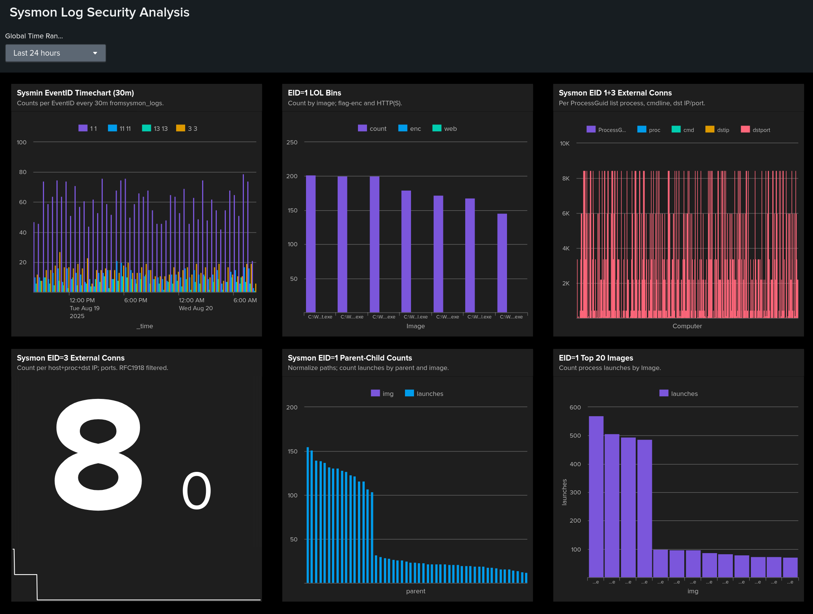

# Splunk Sysmon Log Security Analysis

Sysmon case in Splunk: 6 checks + a dashboard for rapid triage of LOLBin abuse, abnormal parent→child chains, external egress, EventID spikes, public-IP beacons, and noisy executables. Structure and delivery mirror the referenced repo.

**Files**
- Full report (DOCX): **[Sysmon_Logs_report.docx](Sysmon_Logs_report.docx)**
- Dashboard (XML/JSON): **[Dashboard_sysmon.png](Dashboard_sysmon.png)**

---

## Data and Fields
Sysmon events with focus on **EventID 1 (Process Create)** and **3 (Network Connect)**; optional others as available.  
Key fields: `EventID`, `Image`, `ParentImage`, `CommandLine`, `Computer`, `ProcessGuid`, `DestinationIp`, `DestinationPort`. XML parsed via `spath`.  
Default time range: last 24 hours.

---

## Dashboard

**Purpose.** One screen to spot EventID spikes, LOLBin executions with encoding/web pulls, per-process external connections, rare parent→child chains, heavy public-IP beacons, and top executable hotspots.

**Global filters.** Time range, host, process/image. Panels update in sync.

**Panels**
1. **EventID Trends (30m bins)** — baseline and spikes across EventIDs.  
2. **LOLBin + Enc/Web Flags** — signed binaries with `-enc` or URLs in `CommandLine`.  
3. **Per-Process External Egress** — processes that contact public IPs.  
4. **Parent→Child Outliers** — abnormal launch chains (e.g., Office→cmd/powershell).  
5. **Public-IP Beacons by Process** — counts and ports per external destination.  
6. **Top Executables by Launches** — frequency hotspots that may imply persistence or tooling.

**KPIs/thresholds.**
- EventID spike: baseline + **3σ** for ≥60 minutes.  
- LOLBins: any row with `enc>0` or `web>0`.  
- External egress: any non-allowlisted process to public IPs.  
- Parent→child: rare chains or script engines spawning binaries.  
- Beacons: repeated hits to the same IP or odd high ports.  
- Top executables: unexpected tools appearing in top 20.

---

## Checks and Findings

### 1) EventID Baseline and Spikes
**Purpose:** Quantify activity by EventID and find anomalies.  
**Finding:** Sustained peaks in EID 1/3 suggest bursty execution or scanning.  
**Recommendation:** Alert on +3σ ≥60m; pivot by host and process in spike windows.

### 2) LOLBins and Suspicious Commands
**Purpose:** Catch signed binaries abused with encoding and web pulls.  
**Finding:** `powershell/mshta/rundll32/regsvr32/bitsadmin/certutil/wscript` with `-enc` or `http(s)://`.  
**Recommendation:** Triage rare utilities; collect parent trees; harden with AppLocker/WDAC.

### 3) Per-Process External Connections
**Purpose:** Identify processes talking to public IPs.  
**Finding:** Uncommon binaries or high/nonstandard ports are high-signal.  
**Recommendation:** Enrich with DNS/WHOIS/TI; investigate persistent connections.

### 4) Parent→Child Outliers
**Purpose:** Reveal proxy/execution misuse via unusual launch chains.  
**Finding:** Office→cmd/powershell, script hosts spawning binaries.  
**Recommendation:** Normalize expected chains; if suspicious, gather user context and tighten macro policy.

### 5) Public-IP Beacons and Ports
**Purpose:** Rank outbound connections to public IPs by process and destination.  
**Finding:** Excessive hits to one IP or odd high ports.  
**Recommendation:** Pivot to DNS logs; exclude update CDNs; escalate unknown persistent beacons.

### 6) Top Executables by Launch Count
**Purpose:** Surface hotspots indicating persistence or noisy tooling.  
**Finding:** Unexpected tools near the top 20.  
**Recommendation:** Correlate with Task Scheduler/services; filter core OS binaries; reduce noise.

---

## Result
A repeatable Splunk hunting workflow for Sysmon: six targeted checks plus a dashboard enable fast triage, clear thresholds, and actionable steps. Full steps with screenshots are in **Sysmon_Logs_report.docx**. Visual summary is in **Dashboard_sysmon.png** and the preview image `Dashboard_sysmon.png`.
